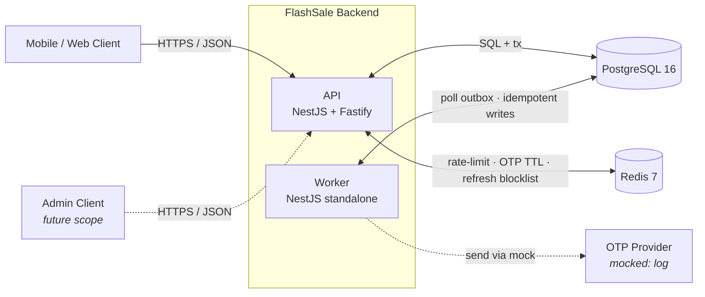
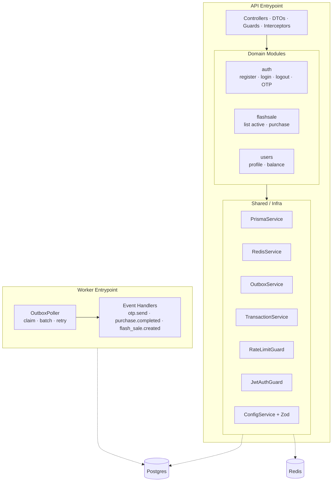
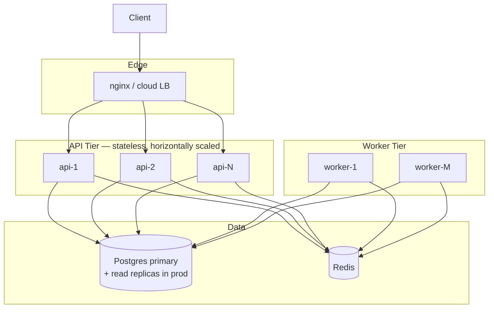
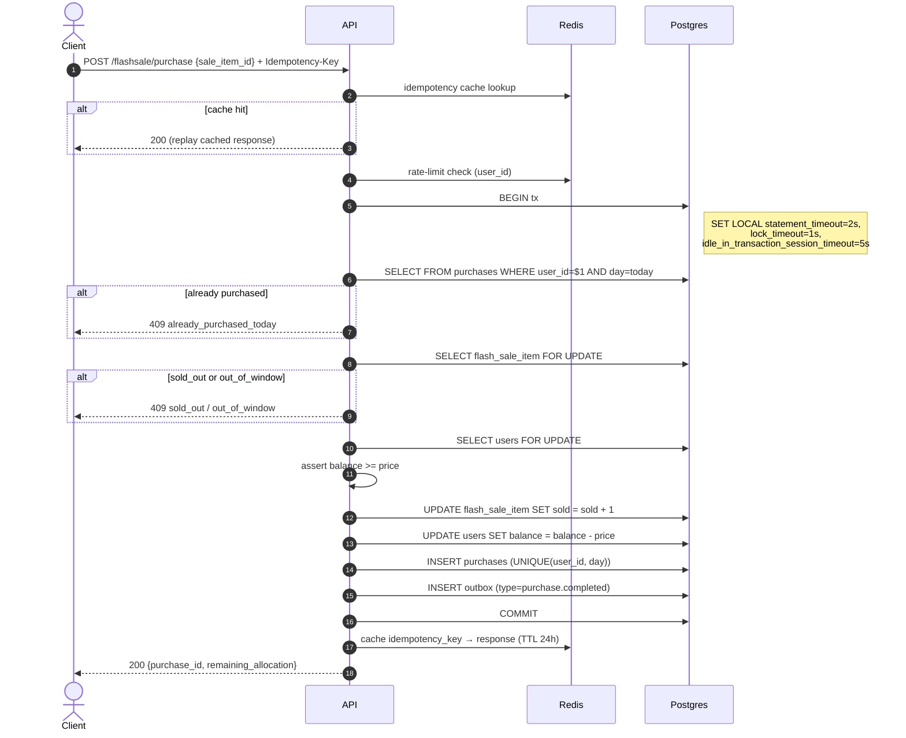
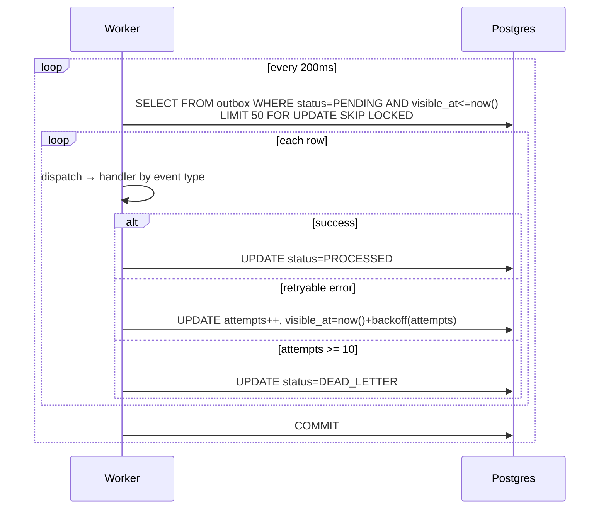
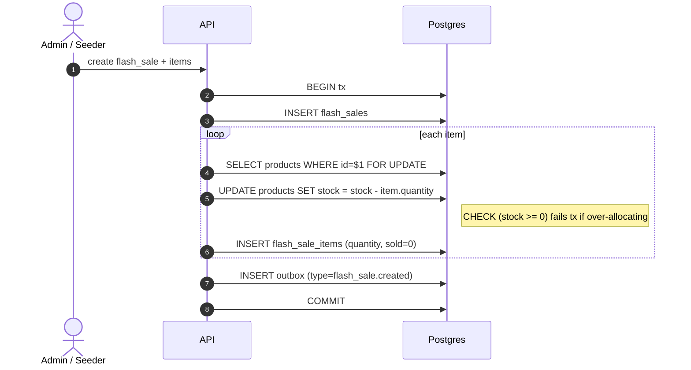
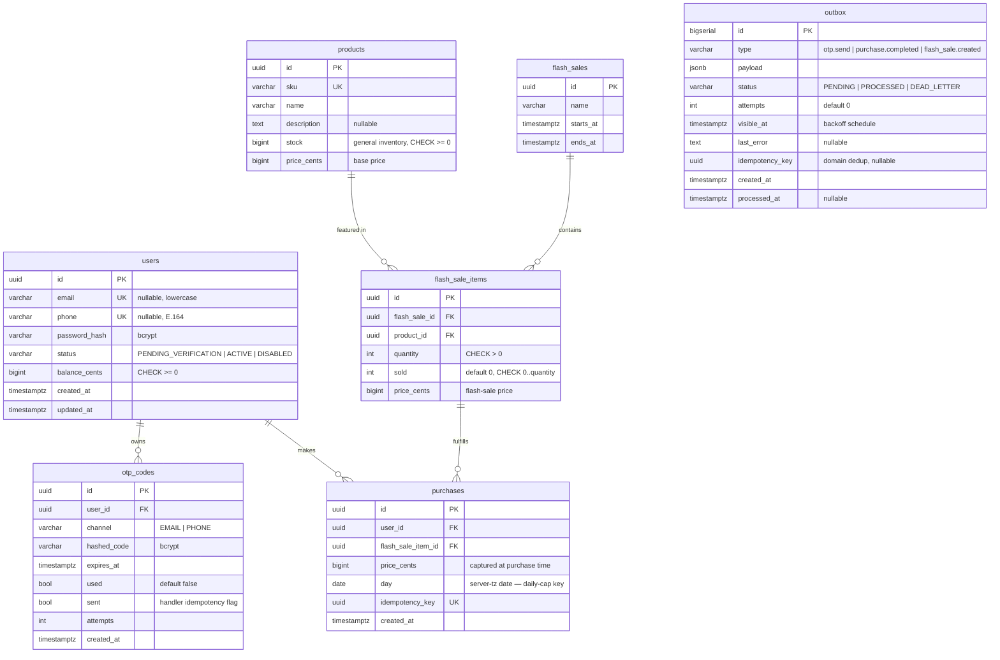
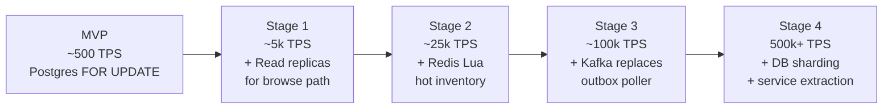

# FlashSale Backend — Design Document

**Stack:** Node.js 20 · NestJS 10 · Fastify · PostgreSQL 16 · Redis 7 · Prisma · TypeScript  
**Deployment:** Docker Compose (single-region, horizontally scalable)

---

## Table of Contents

1. [Goals & Non-Goals](#1-goals--non-goals)
2. [Architecture Overview](#2-architecture-overview)
3. [Component Structure](#3-component-structure)
4. [Deployment Topology](#4-deployment-topology)
5. [Key Data Flows](#5-key-data-flows)
6. [Concurrency & Correctness](#6-concurrency--correctness)
7. [Security Model](#7-security-model)
8. [Data Model](#8-data-model)
9. [API Reference](#9-api-reference)
10. [Reliability & Failure Modes](#10-reliability--failure-modes)
11. [Tradeoffs](#11-tradeoffs)
12. [Evolution Path](#12-evolution-path)

---

## 1. Goals & Non-Goals

### Goals

- **Authentication** — unified register/login/logout for email or phone identifiers, with OTP verification.
- **Flash sales** — time-windowed product promotions with strict inventory control and per-user daily purchase limits.
- **Async event processing** — reliable, idempotent delivery of side-effects (OTP dispatch, downstream notifications) via a transactional outbox.
- **Correctness under concurrency** — no overselling, no double-charging, no lost events, no duplicate side effects.
- **≥ 500 TPS** on the purchase path with p99 < 200ms (demonstrated via k6 load test).

### Non-Goals (explicit)

- Real SMS/email delivery — OTP "send" is mocked via structured log.
- Admin UI / product management — configuration via DB seed and migrations only.
- Real payment integration — balance is pre-seeded; no external payment provider.
- Fulfillment, shipping, refunds.
- Multi-region / geo-replication.
- Sale settlement — returning unsold inventory to `products.stock` when a sale ends is a future scheduler concern.

---

## 2. Architecture Overview

A **modular monolith** with two entrypoints — HTTP API and an async worker — sharing one codebase and one Postgres database.



**Key choices:**

| Decision | Choice | Rationale |
|---|---|---|
| Architecture | Modular monolith + async worker | Clean module boundaries, extractable to microservices; no broker complexity for MVP |
| HTTP adapter | Fastify | ~2× faster than Express at the adapter layer; same NestJS DX |
| Primary store | PostgreSQL 16 | ACID, row-level locking, `FOR UPDATE SKIP LOCKED`, JSON columns |
| ORM strategy | Prisma for schema/migrations + raw SQL for locks | Best TS DX for migrations; raw SQL only where explicit `FOR UPDATE` / `SKIP LOCKED` are needed |
| Async processing | Transactional outbox + polling worker | Exactly-once semantics without a broker; correct and simple at this scale |
| Auth tokens | JWT access (15 min) + opaque refresh (7 days, Redis blocklist) | Stateless verification + instant revocation on logout |
| Inventory model | Eager reservation (Pattern B) | `products.stock` decremented at sale creation; purchase path is one `UPDATE` lighter and avoids a class of races |

---

## 3. Component Structure

The same codebase produces two binaries that differ only in which NestJS bootstrap is invoked.



### Module boundary rules

1. Each domain module exposes only a typed service interface; other modules depend on the interface, never the repository.
2. Cross-module calls go through the interface — never directly into another module's Prisma model.
3. The `flashsale.purchase` flow is the **only** place multiple modules participate in one DB transaction, mediated by `TransactionService`.
4. Controllers belong to their module; no controller reaches into another module's repository.

This makes each domain module independently extractable into a microservice: only its service implementation changes, no consumers change.

---

## 4. Deployment Topology



**Docker Compose services (delivered):**

| Service | Image | Purpose |
|---|---|---|
| `postgres` | `postgres:16-alpine` | Durable store + outbox |
| `redis` | `redis:7-alpine` | Rate limit · OTP TTL · refresh blocklist |
| `migrate` | app image | `prisma migrate deploy` — runs once, gates api/worker startup |
| `api` | app image | NestJS HTTP service (scalable via `--scale api=N`) |
| `worker` | app image | Outbox poller + handlers (scalable via `--scale worker=M`) |

**Statelessness guarantees:** no in-process caches affecting correctness, no sticky sessions, no local filesystem state, logs to stdout. JWT verification is stateless; refresh state is in Redis.

---

## 5. Key Data Flows

### 5.1 Register + OTP verify

```mermaid
sequenceDiagram
    autonumber
    actor U as Client
    participant API
    participant DB as Postgres
    participant W as Worker

    U->>API: POST /auth/register {identifier, password}
    API->>DB: BEGIN tx
    API->>DB: INSERT user (status=PENDING_VERIFICATION)
    API->>DB: INSERT otp_code (hashed_code, expires_at=now+5m)
    API->>DB: INSERT outbox (type=otp.send)
    API->>DB: COMMIT
    API-->>U: 201 {user_id}

    W->>DB: claim outbox row (FOR UPDATE SKIP LOCKED)
    W->>W: "send" OTP (structured log)
    W->>DB: mark outbox PROCESSED

    U->>API: POST /auth/verify-otp {identifier, code}
    API->>DB: SELECT otp WHERE user_id=$1 AND expires_at>now() AND used=false
    API->>API: bcrypt.compare(code, hashed_code)
    API->>DB: UPDATE otp SET used=true; UPDATE user SET status=ACTIVE
    API-->>U: 200 {access_token, refresh_token}
```

- OTP is **bcrypt-hashed at rest** — a DB leak does not expose codes.
- OTP delivery goes through the outbox → at-least-once, idempotent re-delivery.
- User cannot log in until `status=ACTIVE`.

### 5.2 Flash-sale purchase (critical path)



Critical design points:
- **One DB transaction** — all-or-nothing.
- **`READ COMMITTED` + explicit `FOR UPDATE`** — deterministic lock ordering on only the rows that matter, without serialization-failure retries.
- **Three transaction timeouts** per-tx: `statement_timeout=2s`, `lock_timeout=1s`, `idle_in_transaction_session_timeout=5s`.
- **`UNIQUE(user_id, day)` is the race-free daily cap enforcer** — the pre-flight SELECT gives a clean 409; the constraint catches any race that slips through.
- **`products.stock` is never touched here** — units were reserved at sale creation (eager reservation). The purchase path is one `UPDATE` lighter.

### 5.3 Outbox worker



- `FOR UPDATE SKIP LOCKED` — multiple worker replicas pull disjoint batches; linear horizontal scale.
- Backoff: `min(2^attempts × 1s, 5min) + jitter` — avoids thundering herds.
- `DEAD_LETTER` keeps the live queue flowing past poison messages; requires operator intervention to requeue.
- All handlers are **idempotent by design** (keyed on `outbox.idempotency_key` or domain flags) — safe for at-least-once re-delivery.

### 5.4 Sale creation (eager reservation)



- Entire creation is one tx — sale + all reservations + outbox event commit together or not at all.
- `CHECK (products.stock >= 0)` is the DB-level enforcer — concurrent admin requests cannot double-allocate.

---

## 6. Concurrency & Correctness

### 6.1 Hard invariants

1. **No overselling** — `sold <= quantity` for every flash-sale item at all times.
2. **Daily purchase cap** — each user purchases at most one flash-sale item per calendar day.
3. **Balance integrity** — a user's balance never goes negative.
4. **Exactly-once result** — same `Idempotency-Key` always returns the same response; exactly one purchase row.
5. **No lost events** — if the domain tx commits, the outbox event eventually processes.
6. **No duplicate side effects** — each outbox event produces at most one observable side effect.
7. **Inventory invariant** — `Σ flash_sale_items.quantity for active sales ≤ products.stock` at all times.

### 6.2 Threat → mechanism mapping

| Threat | Mechanism | Location |
|---|---|---|
| Two buyers claim the last unit simultaneously | `SELECT flash_sale_item FOR UPDATE` serializes buyers inside the tx | `FlashsaleRepository.purchaseTx` |
| Same user buys twice on the same day | `UNIQUE(user_id, day)` on `purchases` (race-free); pre-flight SELECT for clean 409 | schema + service |
| Concurrent debits drain balance below zero | `SELECT user FOR UPDATE` + assertion before UPDATE | purchase tx |
| Sale over-allocates beyond physical stock | Eager reservation tx + `CHECK (products.stock >= 0)` — DB rejects the tx | `SaleCreationService` |
| Client retry after a timeout | Client-supplied `Idempotency-Key` → Redis response cache (24h) | `IdempotencyInterceptor` |
| Worker crash mid-batch → event lost | Claim tx rolls back → row returns to PENDING; next worker poll reclaims it | `OutboxPoller` |
| Duplicate side effect on retry | Idempotent handlers keyed on outbox `idempotency_key` | each handler |
| Slow query holds locks, starves others | `statement_timeout`, `lock_timeout`, `idle_in_transaction_session_timeout` per tx | `TransactionService` |
| Old JWT replayed after logout | Opaque refresh token invalidated in Redis on logout; short (15m) access TTL bounds exposure | `AuthService.logout` |
| Brute force on credentials / OTP | Token-bucket rate limits per IP and per identifier in Redis; bcrypt; generic error messages | `RateLimitGuard` + auth |

### 6.3 What we deliberately do not use

- **Distributed locks (Redlock, ZooKeeper)** — Postgres row locks are sufficient and have no split-brain failure modes.
- **`SERIALIZABLE` isolation** — forces app-level retries on serialization failures. Explicit `FOR UPDATE` gives deterministic ordering with simpler reasoning.
- **Sagas / 2PC** — all invariants live inside one DB; cross-service transactions are unnecessary.
- **Optimistic concurrency (version columns + retry)** — adds retry latency on the hot-row pattern; pessimistic locks are simpler here.
- **Message broker for MVP** — Postgres outbox meets our exactly-once + 500 TPS target; brokers are an evolution-path concern.

### 6.4 Concurrency test coverage

Every invariant has a corresponding e2e test (real Postgres + Redis via Testcontainers):

| # | Invariant | Test |
|---|---|---|
| 1 | No oversell | 10 concurrent buyers for a `quantity=1` item → exactly 1 success, 9 `sold_out`, `sold=1` |
| 2 | Daily cap | 1 user × 10 concurrent purchases of different items → 1 success, 9 `already_purchased_today` |
| 3 | Balance | `402` on zero balance (balance unchanged); `200` after top-up (balance correctly debited) |
| 4 | Idempotency | Same `Idempotency-Key` twice → identical response, exactly 1 purchase row |
| 5 | No lost events | Rows locked in an aborted tx become reclaimable by the recovery poller |
| 6 | No duplicates | PROCESSED rows skipped on subsequent ticks; handler fires exactly N times for N rows |
| 7 | Convergence | Committed purchase rows === processed `purchase.completed` outbox events |
| 8 | Inventory invariant | Concurrent last-unit allocation → exactly one succeeds, `stock=0` |
| 9 | Stock invariant | `products.stock` unchanged before and after purchases (eager reservation) |

---

## 7. Security Model

### Authentication

| Concern | Control |
|---|---|
| Password storage | bcrypt (cost 12) — never logged, never returned |
| OTP storage | bcrypt-hashed at rest; 5-minute expiry; single-use flag |
| Access token | JWT HS256 (RS256-ready — one-line swap in `JwtModule`), 15-minute TTL |
| Refresh token | Opaque 256-bit random; stored as `sha256(token)` in Redis; logout = `DEL` → instant revocation |
| User enumeration | Generic `401 invalid_credentials` for both "user not found" and "wrong password" |
| Brute force | Token-bucket rate limits per IP and per identifier; constant-time bcrypt compare |

### Authorization

- All write and user-specific endpoints require `JwtAuthGuard` (global APP_GUARD).
- Public endpoints are opted out via `@Public()` decorator — explicit allowlisting, not implicit bypass.
- Ownership checks inside services: a user can only access rows where `user_id = req.user.id`.

### Rate limits

| Endpoint | Limit | Key |
|---|---|---|
| `POST /auth/register` | 5 / 10min | IP |
| `POST /auth/login` | 10 / min / IP · 5 / min / identifier | IP + identifier |
| `POST /auth/verify-otp` | 5 / 5min | identifier |
| `POST /flashsale/purchase` | 10 / sec | user_id |

Implementation: token bucket in Redis via atomic Lua script. On limit exceeded → `429` with `Retry-After`.

### Transport & headers

- HTTPS terminates at the reverse proxy; API listens HTTP internally.
- Helmet middleware — CSP, X-Frame-Options, X-Content-Type-Options, Referrer-Policy, HSTS.
- CORS — allowlist of origins from `CORS_ORIGINS` env var; default-deny.
- No CSRF tokens needed — Bearer token in header, not cookie.

### Input validation

- Every controller uses NestJS DTOs with `class-validator` (`whitelist: true`, `forbidNonWhitelisted: true`). Unknown fields → 400.
- Identifier normalization: email lowercased + trimmed; phone → E.164 via `libphonenumber-js`.
- No SQL injection: Prisma parameterizes all queries; raw SQL spots use `$queryRaw` with parameter binding.

### Secrets

- All secrets via env vars, validated at startup by Zod schema — process exits on missing or malformed value.
- `.env` is git-ignored; `.env.example` has placeholder values.
- Pino redaction: `req.headers.authorization`, `req.body.password`, `req.body.code`, `req.body.refresh_token`.

---

## 8. Data Model

### ERD



### Key constraints

| Constraint | Enforces |
|---|---|
| `CHECK (email IS NOT NULL OR phone IS NOT NULL)` | Every user has at least one identifier |
| `UNIQUE(email)`, `UNIQUE(phone)` | Identifier uniqueness (Postgres `NULLS DISTINCT` — multiple NULLs permitted) |
| `CHECK (balance_cents >= 0)` | Balance can't go negative |
| `CHECK (sold >= 0 AND sold <= quantity)` | Hard oversell barrier — final DB-level defense |
| `UNIQUE(user_id, day)` on `purchases` | **Race-free daily purchase cap** |
| `UNIQUE(idempotency_key)` on `purchases` | Replay safety |
| `CHECK (stock >= 0)` on `products` | **Reservation invariant** — sale creation fails if it would over-allocate |
| `UNIQUE(flash_sale_id, product_id)` | A product appears at most once per sale window |

### Indexes

| Index | Table | Accelerates |
|---|---|---|
| `UNIQUE(email)`, `UNIQUE(phone)` | `users` | Login by identifier |
| `(user_id, channel, used, expires_at)` | `otp_codes` | Verify-OTP lookup |
| `(starts_at, ends_at)` | `flash_sales` | "Active now" query |
| `UNIQUE(user_id, day)` | `purchases` | Pre-flight daily-cap check + constraint |
| `(status, visible_at) WHERE status='PENDING'` | `outbox` | Poller hot query (partial index — stays small) |

### Conventions

- **Money is `bigint` cents** — never `float` or `decimal`; no rounding risk on debits/credits.
- **Timestamps are `timestamptz`** (UTC). `purchases.day` is a `date` derived from `created_at AT TIME ZONE SERVER_TIMEZONE` — configurable, not hard-coded.

---

## 9. API Reference

All endpoints under `/v1`. JSON bodies. Authentication via `Authorization: Bearer <access_token>`.

### Error shape

```json
{
  "error": {
    "code": "already_purchased_today",
    "message": "User has already purchased a flash-sale item today.",
    "details": { "day": "2026-04-25" }
  },
  "request_id": "01HV3X..."
}
```

### Status codes

| Code | Meaning |
|---|---|
| 200 | Success or idempotency replay |
| 201 | Resource created |
| 204 | Success, no body |
| 400 | Validation failure |
| 401 | Missing or invalid auth |
| 402 | Insufficient balance |
| 409 | State conflict (already_purchased_today, sold_out, out_of_window) |
| 422 | Semantic failure (otp_expired, password_too_weak) |
| 429 | Rate limited — includes `Retry-After` |

### Auth endpoints

| Method | Path | Body | Response |
|---|---|---|---|
| POST | `/v1/auth/register` | `{ identifier, password }` | `201 { user_id }` |
| POST | `/v1/auth/verify-otp` | `{ identifier, code }` | `200 { access_token, refresh_token }` |
| POST | `/v1/auth/resend-otp` | `{ identifier }` | `204` |
| POST | `/v1/auth/login` | `{ identifier, password }` | `200 { access_token, refresh_token }` |
| POST | `/v1/auth/refresh` | `{ refresh_token }` | `200 { access_token, refresh_token }` |
| POST | `/v1/auth/logout` | `{ refresh_token }` | `204` |

- `register` returns no token — OTP verification is required first.
- `refresh` rotates the token; the old one is immediately invalidated.
- `logout` invalidates the refresh token in Redis; the access token expires naturally within its 15-minute TTL.

### Flash-sale endpoints

| Method | Path | Auth | Body / Notes |
|---|---|---|---|
| GET | `/v1/flashsale/active` | — | Returns currently active sale items |
| POST | `/v1/flashsale/purchase` | bearer | `{ sale_item_id }` + required `Idempotency-Key` header |

**Purchase response:**
```json
{
  "purchase_id": "...",
  "sale_item_id": "...",
  "price_cents": 15000000,
  "remaining_allocation": 82
}
```

**Active sale item shape:**
```json
{
  "id": "<sale_item_id>",
  "product": { "id": "...", "sku": "...", "name": "..." },
  "price_cents": 15000000,
  "quantity": 100,
  "sold": 17,
  "remaining": 83,
  "window": { "id": "...", "name": "...", "starts_at": "...", "ends_at": "..." }
}
```

### System endpoints

| Method | Path | Purpose |
|---|---|---|
| GET | `/healthz` | Liveness — 200 if process is up |
| GET | `/readyz` | Readiness — 200 if Postgres + Redis reachable |

---

## 10. Reliability & Failure Modes

| Failure | System behavior | Recovery |
|---|---|---|
| API replica crashes mid-request | DB aborts in-flight tx on connection drop → no partial state. LB detects failed `/readyz` and stops routing. | Client retries with same `Idempotency-Key` → safe replay. |
| Worker crashes mid-batch | Claim tx rolls back → rows return to PENDING; next worker poll reclaims them. | Automatic — idempotent handlers make re-runs safe. |
| Postgres unreachable | API returns 503; LB removes replica from rotation. | On reconnect: pool refreshes, `/readyz` flips green. |
| Redis unreachable | Auth paths fail-closed (reject). Purchase path fails-open — DB constraints still protect all invariants. | On reconnect: green. Alert fires so ops can investigate. |
| Slow query holds locks | `statement_timeout` / `lock_timeout` fire → tx rolls back automatically. | Logged + metric incremented. Repeated = page on-call. |
| Outbox handler keeps failing | After 10 attempts → `DEAD_LETTER`; live queue keeps moving. | Operator inspects row, fixes data/code, requeues (`status=PENDING, attempts=0`). |

**Graceful shutdown (SIGTERM):**
1. API stops accepting new connections, drains in-flight requests (25s window).
2. Worker finishes the current outbox batch, stops claiming new ones.
3. Hard exit after 30s if shutdown isn't clean.

---

## 11. Tradeoffs

### Postgres FOR UPDATE vs SERIALIZABLE isolation

`READ COMMITTED` + explicit `FOR UPDATE` locks only the rows that matter. `SERIALIZABLE` would auto-detect conflicts but forces application-level retry loops on any serialization failure — adding latency spikes under contention. Explicit locking gives deterministic ordering with simpler reasoning at our scale.

### Eager reservation (Pattern B) vs lazy reservation (Pattern A)

**Pattern A (lazy):** `products.stock` decremented per purchase. Every purchase hits the `products` row → hot row contention scales with purchase volume. A flash sale for the same product across multiple windows creates multi-row races.

**Pattern B (eager):** `products.stock` decremented once at sale creation; purchases mutate only `flash_sale_items.sold`. The purchase hot-path is one `UPDATE` lighter. The `products.stock` row is only ever contended by admin operations, not by buyers.

Tradeoff: unsold units are "stranded" in `flash_sale_items` until an end-of-sale settlement process reclaims them. This is an acceptable deferred concern for MVP.

### Transactional outbox vs message broker

A Postgres outbox table avoids an external broker dependency, gives us atomic write-and-publish in one transaction, and meets the 500 TPS target. The tradeoff is that the polling worker adds 200ms average delivery latency and the worker's throughput is bounded by Postgres write capacity. At higher fan-out or strict ordering requirements, a broker (Kafka/SQS) is the right next step — see §12.

### Opaque refresh tokens vs long-lived JWTs

Long-lived JWTs are stateless but can't be revoked without waiting for expiry. Short-lived access (15m) + opaque refresh (7d, revocable via Redis `DEL`) bounds the exposure window while preserving instant revocation on logout or compromise.

---

## 12. Evolution Path

The MVP is designed so that no decision needs to be undone at any scale stage. Module boundaries, idempotency keys, the outbox pattern, and stateless API design are the foundation each stage builds on.



| Stage | Trigger | Change | Risk |
|---|---|---|---|
| 1 | Browse-path DB CPU rising | Add Postgres read replicas; route `GET /flashsale/active` to replicas; Redis cache with 1–5s TTL | Replication lag visible on browse, not on purchase |
| 2 | Single-item hot-row lock dominates p99 | Move flash-sale inventory counter to Redis (`DECR` via Lua); persist purchase row in Postgres separately; reconcile Redis ↔ DB in worker | Two sources of truth — reconciliation logic required; Redis state must be recoverable from DB on restart |
| 3 | Worker poll lag growing; multiple consumer types | Replace outbox poller with Kafka (Debezium reads Postgres WAL); multiple independent consumers (notifications, analytics, search) | Operational complexity |
| 4 | Postgres primary write throughput maxed | Shard `purchases` by `user_id`; extract `inventory` service (interface already exists); saga for cross-service purchase | Distributed tx semantics; significant infrastructure overhead |

The hot-row `FOR UPDATE` on a single `flash_sale_item` becomes the bottleneck above ~1k–2k concurrent buyers per item (the empirical Postgres serial-commit ceiling on a single row). Stage 2's Redis counter removes that ceiling. For the assignment's 500 TPS target, we are well within the MVP's comfortable operating range.
